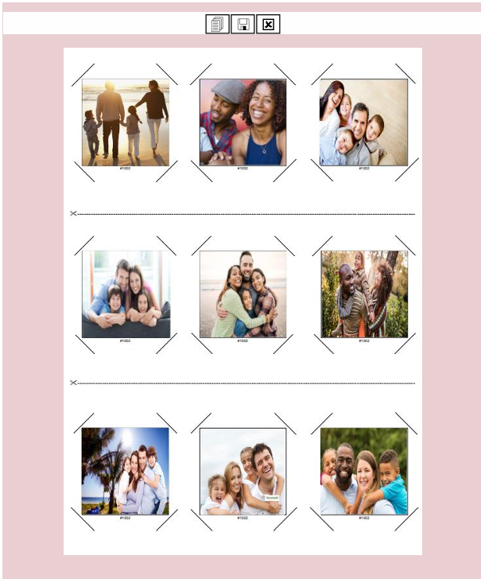

# ImageCut Pro
ImageCut Pro is a .NET Windows-based desktop application designed for users to create precise, print-ready image layouts. The application allows users to upload up to 9 images, which are automatically arranged into a PDF grid. Each image is resized to 50mm x 50mm and enclosed in an octagonal cutting guide for easy trimming.

## Key Features:
 - **Upload Functionality:** Supports uploading 9 different images.
 - **PDF Generation:** Automatically generates a PDF with the images arranged in a 3x3 grid format.
 - **Precise Image Resizing:** Each image is resized to exactly 50mm x 50mm.
 - **Octagonal Cutting Guides:** Every image is surrounded by an octagon, making it easy to cut each image accurately.
 - **Validation:** Ensures the correct number of images is uploaded and verifies the order number.
 - **Login System:** Includes user authentication for secure access.

ImageCut Pro is ideal for projects requiring accurate image placement and cutting, such as crafting, professional printing, and sticker creation.

## Output

**Feel free to reach out for any type of software development services!**